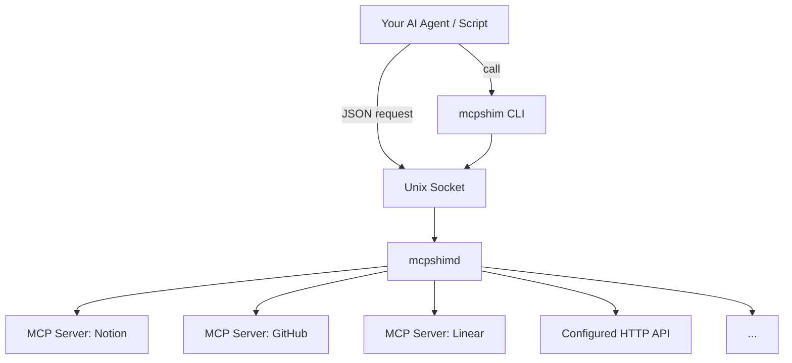

<p align="center">
	
</p>

<h1 align="center">MCPShim</h1>

<p align="center">
	<strong>Use any MCP server or HTTP API as a standard CLI command.</strong><br/>
	A lightweight daemon + CLI that turns remote MCP tools and configured HTTP endpoints into native shell commands your agent or script can call directly.
</p>

<p align="center">
	<a href="https://mcpshim.dev">Website</a> · <a href="https://github.com/mcpshim/mcpshim">Repository</a> · <a href="#quick-start">Quick Start</a> · <a href="#core-commands">Core Commands</a>
</p>

---

## The Problem

Remote MCP servers and HTTP APIs are powerful, but each service has its own auth flow, transport expectations, and invocation patterns. Wiring all of that directly into every script or agent loop creates brittle command workflows.

For LLM agents, there is also context pressure: dumping raw MCP schemas for every connected server can consume prompt budget before useful work begins.

## The Solution

`mcpshimd` centralizes MCP registration and OAuth alongside configured HTTP
service bindings, discovery, call execution, and history behind one local
socket.

`mcpshim` exposes every remote MCP tool and configured HTTP operation as a
standard CLI command. Flags map to tool parameters and output comes back as
structured JSON. No SDKs or libraries are required by the caller.



## Why MCPShim

|                          | Without MCPShim               | With MCPShim                        |
| ------------------------ | ----------------------------- | ----------------------------------- |
| **Tool integration**     | Custom per-service wiring     | One daemon + one CLI                |
| **Auth handling**        | Per-script OAuth/header logic | Centralized in `mcpshimd`           |
| **Tool invocation**      | Provider-specific conventions | `mcpshim call --server --tool ...`  |
| **HTTP API binding**     | Hand-written client code       | Typed or constrained raw tools     |
| **Agent context budget** | Large MCP schemas in prompt   | Alias-based local command workflows |
| **Operational history**  | Ad-hoc logging                | Built-in call history in SQLite     |

---

## Architecture

| Component  | Role                                                              |
| ---------- | ----------------------------------------------------------------- |
| `mcpshimd` | Local daemon for MCP/HTTP registry, discovery, auth, calls, and IPC |
| `mcpshim`  | CLI client for config, discovery, tool calls, history, and script |

All client calls go through a Unix socket and JSON request/response protocol.

## Quick Start

### 1. Install from source

```bash
go install github.com/mcpshim/mcpshim/cmd/mcpshimd@latest
go install github.com/mcpshim/mcpshim/cmd/mcpshim@latest
```

### 2. Configure

```bash
mkdir -p ~/.config/mcpshim
cp configs/mcpshim.example.yaml ~/.config/mcpshim/config.yaml
```

### 3. Start daemon and inspect

```bash
mcpshimd
mcpshim status
mcpshim servers
mcpshim tools
```

### Path Defaults

| Resource | Default Location                    | Override                        |
| -------- | ----------------------------------- | ------------------------------- |
| Config   | `~/.config/mcpshim/config.yaml`     | `--config`, `$MCPSHIM_CONFIG`   |
| Socket   | `$XDG_RUNTIME_DIR/mcpshim.sock`     | `mcpshimd --socket ...`         |
| Database | `~/.local/share/mcpshim/mcpshim.db` | `server.db_path` in YAML config |

All paths follow XDG defaults where applicable.

### Daemon flags

| Flag        | Description               |
| ----------- | ------------------------- |
| `--config`  | Path to config YAML       |
| `--socket`  | Override unix socket path |
| `--debug`   | Enable debug logging      |
| `--version` | Print version and exit    |

---

## Core Commands

| Command                                               | Description                      |
| ----------------------------------------------------- | -------------------------------- |
| `mcpshim servers`                                     | List registered MCP/HTTP services |
| `mcpshim tools [--server name] [--full]`              | List tools for all or one server |
| `mcpshim inspect --server s --tool t`                 | Show tool schema/details         |
| `mcpshim call --server s --tool t --arg value`        | Execute a tool call              |
| `mcpshim add --name s --url ... [--alias a]`          | Register a new MCP endpoint (opt-in) |
| `mcpshim set auth --server s --header K=V`            | Set auth headers for a server (opt-in) |
| `mcpshim remove --name s`                             | Remove a registered server (opt-in) |
| `mcpshim reload`                                      | Reload daemon configuration      |
| `mcpshim validate [--config path]`                    | Validate config file             |
| `mcpshim login --server s [--manual]`                 | Complete OAuth login flow        |
| `mcpshim history [--server s] [--tool t] [--limit n]` | Show persisted call history      |
| `mcpshim history --clear [--server s] [--tool t]`     | Clear scoped call history        |
| `mcpshim history --clear --all`                       | Clear all call history           |
| `mcpshim script [--install] [--dir ~/.local/bin]`     | Generate/install alias wrappers  |

### Register MCP servers

The config file is the source of truth. Edit it and reload:

```bash
$EDITOR ~/.config/mcpshim/config.yaml
mcpshim reload
```

`add`, `set auth`, and `remove` do the same thing over the socket, and are
**refused by default**. Those actions rewrite the config file, so leaving them
enabled makes socket access equivalent to config write access - which matters
because anything reaching the socket is already able to call every tool you
have registered. Turn them on only when runtime registration is worth that:

```yaml
server:
  allow_registry_writes: true
```

```bash
mcpshim add --name notion --alias notion --transport http --url https://example.com/mcp
mcpshim set auth --server notion --header 'Authorization=Bearer ${NOTION_MCP_TOKEN}'
mcpshim reload
```

Credentials are never readable back through the socket either way: `servers`
reports `has_auth` as a boolean and never returns header values.

### Dynamic flags

Tool flags are converted automatically to MCP arguments:

```bash
mcpshim call --server notion --tool search --query "projects" --limit 10 --archived false
```

> Tip: JSON output is automatic when stdout is not a terminal. Put the global
> `--json` before the command to force JSON output in a terminal. On `call`,
> `--json` after the tool selector parses JSON-like text fields returned by the
> remote tool.

Objects, arrays, and null can be passed as JSON values. MCPShim uses the
discovered tool schema to keep string properties as strings:

```bash
mcpshim call --server notion --tool search \
  --filter '{"status":"open"}' \
  --ids '[1,2,3]' \
  --cursor null
```

---

## HTTP Services

Ordinary HTTP APIs can be exposed without implementing an MCP server. A service
owns its base URL, credentials, and policy, then publishes typed tools, a
constrained raw request tool, or both:

```yaml
http_services:
  - name: deployment-api
    alias: deploy
    base_url: https://deploy.example.com/api
    headers:
      Authorization: Bearer ${DEPLOY_API_TOKEN}
    policy:
      redirects: same-origin
      allowed_request_content_types: [application/json]
      max_response_bytes: 2097152
    raw_tool:
      name: request
      methods: [GET, POST, PATCH]
      paths: [/v1/deployments/**]
    tools:
      - name: get_deployment
        request:
          method: GET
          path: /v1/deployments/{deployment_id}
        inputs:
          deployment_id:
            type: string
            required: true
```

```bash
mcpshim call --server deploy --tool get_deployment --deployment_id dep_123
mcpshim call --server deploy --tool request \
  --method PATCH \
  --path /v1/deployments/dep_123 \
  --body '{"desired_state":"running"}'
```

Typed request bodies, queries, and headers support deeply nested structural
templates with `$arg`, `$default`, `$omit_if_missing`, and `$format`. The raw
tool remains limited to configured methods and wildcard paths and cannot
override authentication or other protected headers.

See the [complete HTTP service guide](docs/http-services.md) and
[`configs/http-services.example.yaml`](configs/http-services.example.yaml).

---

## OAuth Flow

For OAuth-capable MCP servers, you can configure URL-only registration:

```bash
mcpshim add --name notion --alias notion --transport http --url https://mcp.notion.com/mcp
```

When a request receives `401` and no `Authorization` header is configured,
MCPShim checks its SQLite token store. If authorization is still required, the
command tells you to run an explicit login instead of starting an interactive
browser flow inside the daemon.

You can also pre-authorize:

```bash
mcpshim login --server notion
mcpshim login --server notion --manual
```

`--manual` supports cross-device auth by printing a URL and accepting pasted callback URL/code.

---

## Call History

Every `mcpshim call` is recorded by `mcpshimd` with timestamp, server/tool, args, status, and duration.

```bash
mcpshim history
mcpshim history --server notion --limit 20
mcpshim history --server notion --tool search --limit 100
mcpshim history --server notion --clear
mcpshim history --clear --all
```

History is stored locally in SQLite (`call_history` table). The daemon retains
the newest 1,000 calls by default; set `server.history_size` in the YAML config
to choose another positive limit. Clearing requires at least one filter or an
explicit `--all`.

---

## IPC Protocol

`mcpshim` communicates with `mcpshimd` over a Unix socket using JSON messages with an `action` field.

```json
{"action":"status"}
{"action":"servers"}
{"action":"tools","server":"notion"}
{"action":"inspect","server":"notion","tool":"search"}
{"action":"call","server":"notion","tool":"search","args":{"query":"roadmap"}}
{"action":"history","server":"notion","limit":20}
{"action":"clear_history","server":"notion"}
{"action":"clear_history","all":true}
{"action":"add_server","name":"notion","alias":"notion","url":"https://mcp.notion.com/mcp","transport":"http"}
{"action":"set_auth","name":"notion","headers":{"Authorization":"Bearer ..."}}
{"action":"reload"}
```

---

## Lightweight Aliases

Generate shell functions:

```bash
eval "$(mcpshim script)"
notion search --query "projects" --limit 10
```

If a server name/alias contains shell-incompatible characters (spaces, dashes, punctuation) MCPShim automatically normalizes it to a safe function name (for example, `my-server` becomes `my_server`).

Install executable wrappers instead:

```bash
mcpshim script --install --dir ~/.local/bin
notion search --query "projects" --limit 10
```

---

## Deployment

`mcpshimd` never executes a child process. MCP and configured API traffic uses
HTTP or SSE, so the daemon is a credential-holding outbound proxy rather than a
local code-execution surface. That makes it well suited to running in its own
container with only the socket exposed to the agent.

See [`docs/deployment.md`](docs/deployment.md) for the topologies, the trust
model of the socket, OAuth in containers, and the operational caveats.

---

## See Also

**[Pantalk](https://github.com/pantalk/pantalk)** - Give your AI agent a voice on every chat platform. MCPShim gives your agent tools; Pantalk gives it a voice across Slack, Discord, Telegram, and more. Together they form a complete agent infrastructure stack.
