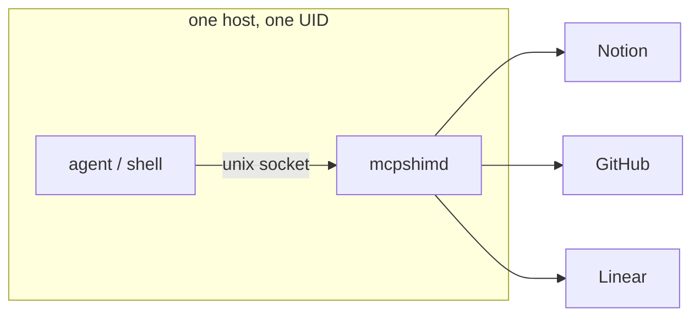
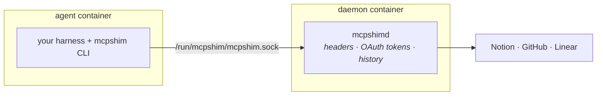
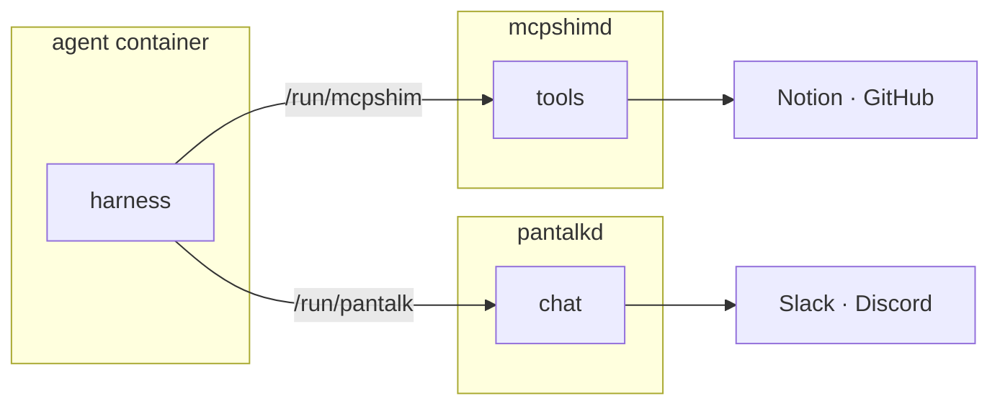

# Deployment

MCPShim is two processes and one socket. `mcpshimd` holds the server registry,
the auth headers, and the OAuth tokens; `mcpshim` is a client that speaks JSON
over a Unix domain socket. As with any daemon of this shape, the deployment
question is:

> **Where does the agent run, relative to the daemon?**

MCPShim answers that question differently from most agent-adjacent daemons,
because of one structural fact worth stating before anything else.

## The one thing that makes MCPShim different

**`mcpshimd` never executes a child process.** MCP servers use `http` or
`streamable-http`/`sse`, and configured HTTP services make bounded outbound
requests below an operator-selected base URL. There is no stdio MCP transport,
local harness, or command allowlist to police. Interactive OAuth runs only in
an explicit `mcpshim login` client process, not through the daemon socket.

That removes an entire class of risk. The daemon is a **credential-holding
outbound proxy**, nothing more.

It also relocates the risk. The daemon's value to an attacker is not code
execution on your host - it is the **standing authorization it holds to your
SaaS accounts**. A `mcpshimd` with Notion, GitHub, and Linear registered is a
process that can read and write those accounts without asking anyone, and
whose socket hands that ability to whoever connects.

So the calculus differs from a harness-executing daemon:

| | Harness-executing daemon | `mcpshimd` |
| --- | --- | --- |
| Worst case from socket access | Code execution as the daemon user | Full use of every configured service credential |
| Config file is | A credential store | A credential store **the socket can rewrite** |
| Untrusted input arrives via | Chat messages reaching the harness | Tool *results* flowing back into the agent |
| Isolation lever | Sandbox the harness | Split the registry across daemons |

---

## Read this first: what the socket grants

The daemon listens on a Unix socket created with mode `0600`
([`server.go`](../internal/server/server.go)). That is the entire access control
model - **no authentication, no per-client identity, no per-server scoping.**
Anyone who can connect gets every action:

| Action | What a socket client can do |
| --- | --- |
| `call` | Invoke **any MCP or HTTP tool on any registered service**, using its stored credentials |
| `tools`, `inspect` | Enumerate every tool on every MCP or HTTP service |
| `servers` | List names, aliases, kinds, URLs, transports, and whether auth is set |
| `history` | Read every recorded call **including its full arguments** |
| `add_server` | Register a new MCP endpoint and persist it to `config.yaml` — **disabled by default** |
| `set_auth` | Overwrite auth headers for an MCP server and persist them to disk — **disabled by default** |
| `remove_server` | Delete an MCP server from the config on disk — **disabled by default** |
| `reload` | Re-read config, and switch the SQLite database if `db_path` changed |

Two of those deserve emphasis, because they are stronger than the equivalent in
most sibling daemons:

**The socket can be given write access to the config file.** `add_server`,
`set_auth`, and `remove_server` all call `config.Save()`, so a socket client
does not merely *use* the configuration - it *edits* it durably, and the daemon
picks the edit up immediately. They are refused unless
`server.allow_registry_writes: true`, which keeps socket access from implying
config write access. Leave it off and manage the registry by editing the file
and running `mcpshim reload`; mounting the config read-only is a second layer
under it. Validation and persistence complete before the running registry
changes.

**Credentials cannot be read back, but they can be used.**
`ServerInfo` deliberately exposes `has_auth` as a boolean rather than the
headers themselves, so `servers` is not a token dump. OAuth tokens are bound to
both server name and endpoint, so re-pointing a name does not reuse the old
grant. Socket access still grants the ability to exercise the credentials
through every tool on the registered endpoint.

Configured HTTP bindings are part of the same trust boundary. Typed tools can
send only their configured requests. A raw HTTP tool can use every method,
wildcard path, and request header in its allowlist, but cannot change the base
origin or protected headers. Keep those allowlists narrow.

There is no TCP listener. `mcpshimd` only calls `net.Listen("unix", ...)`, so
reaching the daemon across a network is always something you build, and you own
the authentication for it.

---

## 1. All-in-one

Daemon and agent share a host and a user. This is what `mcpshimd` plus
`eval "$(mcpshim script)"` gives you, and it is the right default for a single
developer on their own machine.



### The caveat

An agent in this topology holds, by construction:

- **The right to call every tool on every registered server.** Not the tools you
  meant to give it - all of them. `mcpshim call --server github --tool
  delete_repo` is available to anything that can reach the socket.
- **Read access to `call_history`**, which stores full tool arguments up to the
  configured retention limit (1,000 calls by default). If a colleague's recent
  session put a customer identifier, a document body, or a secret into an
  argument, it may still be there.
- **Write access to the registry**, but only if you enabled
  `server.allow_registry_writes`. Off by default, socket clients cannot add
  servers or change auth.
- **Read access to `config.yaml`** through the filesystem, which may contain
  literal auth headers. Prefer environment references to avoid writing
  resolved credentials there.

Now add the property specific to tool-calling daemons: **MCP tool results are
untrusted input.** A page in Notion, an issue body on GitHub, a row from a
third-party server - all of it flows back into the agent's context, and any of
it can carry instructions. An agent that reads an attacker-authored issue and
then has unrestricted `call` access to every other registered server is the
canonical confused-deputy setup. The lateral move is Notion → GitHub, and
MCPShim is what makes it one command.

This is fine when the registered servers are all yours and the agent only reads
data you authored. It stops being fine the moment any registered server carries
content from outside your trust boundary.

### Making Topology 1 defensible

1. **Register the minimum.** The registry is the permission set. A server you
   have not registered is one the agent cannot reach - this is by far the
   strongest lever available, and it costs nothing.
2. **Prefer scoped tokens over OAuth breadth.** `set auth --header` with a
   fine-grained, read-only PAT beats a full OAuth grant whenever the service
   offers one, because MCPShim has no per-tool authorization of its own.
3. **Keep the config `0600` and the DB `0600`.** `config.Save` writes `0600` and
   the store directory is `0700`; do not loosen them.
4. **Treat `history` as sensitive.** It is a durable log of tool arguments. Put
   the data directory wherever your other secrets live, choose an appropriate
   `server.history_size`, and use scoped `history --clear` operations when
   required.
5. **Split by trust boundary**, per [§5](#multi-tenancy-one-daemon-per-trust-boundary).

---

## 2. Socket export

Run the daemon in its own container. Give the agent container **only the
socket** - not the config, not the SQLite database.



**This is the topology MCPShim is best suited to**, and the reason is the
structural fact from the top: because the daemon never execs a harness, moving
the agent out costs nothing. There is no `driver:` to break, no binary the
daemon needs, no inversion to perform. The CLI is already the only interface.
You simply stop running the agent next to the daemon, and everything keeps
working.

What the split buys:

- The agent cannot read `config.yaml`, so cleartext auth headers leave its reach.
- The agent cannot read `mcpshim.db`, so OAuth refresh tokens leave its reach.
- The agent container can be denied all egress except the socket. **The daemon
  becomes the only process with internet access** - which for a tool-calling
  agent is a meaningful containment story, since exfiltration then has to go
  through a tool call you can see in `history`.
- Each agent gets its own filesystem, workspace, and resource limits.

What it does **not** buy: any restriction on *which* servers or tools the agent
may call. The socket is all-or-nothing. Genuine partitioning means one daemon
per set of credentials - see [§5](#multi-tenancy-one-daemon-per-trust-boundary).

### Four things that will bite you

**1. The socket is `0600` - UIDs must match.**
No group bits, so group ownership and `fsGroup` cannot help. The agent
container's process must run as the same numeric UID as the daemon, or as root
(which bypasses the check and gives that container root on the shared volume).
Pin both explicitly with `user: "10001:10001"`.

**2. Mount the socket's *directory*, not the socket file.**
On startup the daemon does `os.Remove(socketPath)` then re-listens. A bind mount
of the file pins the old inode, so every daemon restart silently breaks every
client. Mount the parent directory.

**3. The client finds the socket via `XDG_RUNTIME_DIR`.**
There is no `MCPSHIM_SOCKET` variable. The default is
`$XDG_RUNTIME_DIR/mcpshim.sock`, falling back to `/tmp/mcpshim-<uid>.sock`. In
the agent container set `XDG_RUNTIME_DIR=/run/mcpshim`, or pass `--socket` on
every call. Set the env var - generated alias wrappers from `mcpshim script` do
not carry a `--socket` flag.

**4. `mcpshim login` does not use the socket at all.**
This is the one that breaks the model. `runLoginLocal`
([`client.go`](../internal/client/client.go)) loads the config from
`DefaultConfigPath()` and opens the SQLite database **directly**, in the CLI
process. It never connects to the daemon. So OAuth login from a socket-only
agent container cannot work - and should not be made to work by mounting the
config and DB in, because that hands back exactly what the split was protecting.

Do OAuth login **operator-side**, on the daemon's config and database, before or
outside the agent's lifecycle. See [OAuth in containers](#oauth-in-containers).

### Compose example

The repository's Dockerfile builds the published image. Pull a versioned image
from `ghcr.io/mcpshim/mcpshim`, or build it locally:

```bash
docker pull ghcr.io/mcpshim/mcpshim:v0.0.3
docker build --build-arg VERSION=dev --tag mcpshim/mcpshim:local .
```

```yaml
name: mcpshim-split

services:
  mcpshimd:
    image: ghcr.io/mcpshim/mcpshim:v0.0.3
    restart: unless-stopped
    user: '10001:10001'
    command: ['--socket', '/run/mcpshim/mcpshim.sock']
    volumes:
      - ./config:/home/mcpshim/.config/mcpshim # NOT :ro - see note below
      - mcpshim-data:/home/mcpshim/.local/share/mcpshim
      - mcpshim-run:/run/mcpshim
    healthcheck:
      test: ['CMD', 'mcpshim', '--socket', '/run/mcpshim/mcpshim.sock', 'status']
      interval: 30s
      timeout: 5s
      retries: 3

  agent:
    image: your-registry/harness:latest
    restart: unless-stopped
    user: '10001:10001'
    depends_on:
      mcpshimd:
        condition: service_healthy
    environment:
      XDG_RUNTIME_DIR: /run/mcpshim
    volumes:
      - mcpshim-run:/run/mcpshim
      - workspace:/workspace
    # the daemon is the only process that needs the internet
    # networks: [internal]

volumes:
  mcpshim-data:
  mcpshim-run:
  workspace:
```

**On the registry being writable.** The default already refuses socket-driven
registry edits, so the compose file above needs nothing extra. Two layers are
available and they compose:

- **`server.allow_registry_writes: false` (default).** `add_server`, `set_auth`,
  and `remove_server` are refused before touching disk. Manage servers by
  editing the config and running `mcpshim reload`. This is the right production
  posture, and it is what you get by doing nothing.
- **A read-only config mount.** Mount `:ro` as defence in depth, so even a
  daemon started with writes enabled cannot persist a change. Note the two fail
  differently: the flag refuses cleanly, the mount fails at the write.

Enable writes only where runtime registration is worth it - a development box,
or a workflow that genuinely registers servers on the fly. Together with the
`has_auth`-only response, which means the socket can never read your headers
back out, the default gets you a credential-tight daemon without extra work.

### Reaching a remote daemon

The protocol is unauthenticated and unencrypted, because a `0600` Unix socket
made both unnecessary. Any relay must restore both.

```bash
# Good: SSH supplies the authentication and the encryption.
ssh -N -L /local/run/mcpshim.sock:/run/user/1000/mcpshim.sock ops@daemon-host
XDG_RUNTIME_DIR=/local/run mcpshim servers
```

```bash
# NEVER: an unauthenticated remote "use all my OAuth grants" API.
socat TCP-LISTEN:9999,fork UNIX-CONNECT:/run/mcpshim/mcpshim.sock
```

---

## 3. Sidecar

Topology 2 with a shared lifecycle. Because `mcpshimd` is a small static Go
binary with SQLite and no external dependencies, the **daemon-per-workload**
sidecar is cheap - and it is the only shape that gives each agent a genuinely
distinct set of credentials, since the socket has no per-server scoping.

```yaml
apiVersion: apps/v1
kind: StatefulSet
metadata:
  name: mcpshim
spec:
  replicas: 1
  serviceName: mcpshim
  selector:
    matchLabels: { app: mcpshim }
  template:
    metadata:
      labels: { app: mcpshim }
    spec:
      securityContext:
        runAsUser: 10001 # must match across BOTH containers
        runAsGroup: 10001
        runAsNonRoot: true
      volumes:
        - name: run
          emptyDir: {}
        - name: config
          secret: { secretName: mcpshim-config } # read-only by nature
      containers:
        - name: mcpshimd
          image: ghcr.io/mcpshim/mcpshim:v0.0.3
          args: ['--socket', '/run/mcpshim/mcpshim.sock']
          env:
            - name: MCPSHIM_CONFIG
              value: /etc/mcpshim/config.yaml
          volumeMounts:
            - { name: run, mountPath: /run/mcpshim }
            - { name: config, mountPath: /etc/mcpshim, readOnly: true }
            - { name: data, mountPath: /home/mcpshim/.local/share/mcpshim }
          readinessProbe:
            exec:
              command: ['mcpshim', '--socket', '/run/mcpshim/mcpshim.sock', 'status']
            initialDelaySeconds: 5
            periodSeconds: 30
          securityContext:
            allowPrivilegeEscalation: false
            readOnlyRootFilesystem: true
            capabilities: { drop: ['ALL'] }

        - name: agent
          image: your-registry/harness:latest
          env:
            - name: XDG_RUNTIME_DIR
              value: /run/mcpshim
          volumeMounts:
            - { name: run, mountPath: /run/mcpshim }
          securityContext:
            allowPrivilegeEscalation: false
            capabilities: { drop: ['ALL'] }
  volumeClaimTemplates:
    - metadata: { name: data }
      spec:
        accessModes: ['ReadWriteOnce']
        resources: { requests: { storage: 1Gi } }
```

Notes specific to Kubernetes:

- **`replicas: 1`.** OAuth tokens and history live in SQLite on a `ReadWriteOnce`
  volume. Two replicas means two token stores drifting apart and two halves of
  your history. Scale by adding daemons with *different registries*, never
  replicas of one.
- **A `Secret` mount is read-only**, which reinforces the default
  `allow_registry_writes: false`. Leave the flag off and `add_server` is refused
  before it ever reaches the read-only file.
- **`emptyDir` for the socket, matching `runAsUser`.** `fsGroup` cannot rescue a
  `0600` file.
- **Bootstrap OAuth tokens out of band** - a `Secret` seeded into the data volume,
  or a one-shot interactive job. The running pod cannot complete a browser flow.
- **`readOnlyRootFilesystem: true` works** on the daemon, since it writes only to
  the data volume and the socket dir. That is a nice property of a daemon that
  never execs anything.

---

## 4. Alongside Pantalk

MCPShim and [Pantalk](https://github.com/pantalk/pantalk) are complementary
halves of the same stack: MCPShim gives an agent tools, Pantalk gives it a
voice. Deployed together they are two daemons and two sockets, and the same
rules apply to each.



Two things to get right:

**Separate socket directories, one `XDG_RUNTIME_DIR`.** Both daemons default to
`$XDG_RUNTIME_DIR/<name>.sock` with different basenames, so a single shared
runtime directory holds both sockets without collision - and both CLIs find
theirs with no flags. That is the tidy arrangement:

```yaml
environment:
  XDG_RUNTIME_DIR: /run/agent
volumes:
  - shared-run:/run/agent # contains mcpshim.sock and pantalk.sock
```

**Understand the combined exposure.** Pantalk's caveat is that chat input is
untrusted and reaches the harness. MCPShim's caveat is that the harness can call
every registered tool. Together, an unauthenticated stranger in a Slack channel
is two hops from your Notion workspace. That composition is the point of the
stack - and the reason to be deliberate about which servers are in the registry
of the daemon that a chat-reachable agent can talk to.

If you run [Pantalk Ghost](https://github.com/pantalk/ghost), the same logic
holds: Ghost is explicitly a single-tenant trusted-host environment, so an
`mcpshimd` reachable from inside it inherits that posture. Keep its registry
narrow.

---

## 5. Everything else

### Multi-tenancy: one daemon per trust boundary

The socket grants all-or-nothing access to the registry, so **the daemon is the
unit of authorization.** There is no per-server or per-tool permission to
configure - the set of registered servers *is* the permission set. Split
whenever the boundary matters:

| Split by | Example |
| --- | --- |
| Blast radius | Read-only servers in one daemon, write-capable in another |
| Data sensitivity | Customer-data servers never share a daemon with public ones |
| Agent | An untrusted or experimental agent gets its own narrow registry |
| Environment | Staging credentials never share a daemon with production |

Each daemon needs its own `--socket`, `--config`, and `db_path`. Running several
is cheap and it is the only partition the architecture enforces.

### OAuth in containers

This needs planning, because the interactive flow assumes a desktop:

- **`login` is CLI-local.** It bypasses the daemon and touches config + DB
  directly, so run it where those files live - `docker exec` into the daemon
  container, or on the host against the same paths before first start.
- **The callback listener binds `127.0.0.1:0`** - an ephemeral port inside the
  container's network namespace. A browser on your laptop cannot reach it.
- **`--manual` is the containerized path.** It prints the authorization URL,
  you complete login in any browser on any device, and paste the redirect URL
  back. Note it reads from **stdin of the process running the flow**, so you need
  an interactive exec: `docker exec -it mcpshimd mcpshim login --server notion --manual`.
- **Daemon calls do not start interactive login.** If a call still requires
  authorization after checking stored tokens, it fails with an instruction to
  run `mcpshim login`. Pre-authorize deliberately from an operator-side process.
- **Tokens live in the `oauth_tokens` SQLite table** on the data volume. Back it
  up, and treat it as a credential store - it holds refresh tokens.

### Secrets

Header values and URLs are expanded in a disposable copy when MCPShim creates a
connection, so `${TOKEN}` references work and keep the literal secret out of
the YAML:

```yaml
servers:
  - name: example
    transport: sse
    url: https://mcp.example.com/sse
    headers:
      Authorization: Bearer ${TOKEN}
```

An unset variable fails config validation with its variable name. Config
mutations preserve existing environment references instead of writing resolved
credentials to disk.

There is no `_FILE` indirection, so Kubernetes secret files and Docker secrets
need projecting into environment variables rather than mounted as paths.

### Persistence and backup

| Path | Contents | Loss impact |
| --- | --- | --- |
| `~/.local/share/mcpshim/mcpshim.db` | `oauth_tokens`, `call_history` | Re-authorize every OAuth server and lose local call history |
| `~/.config/mcpshim/config.yaml` | Registry, aliases, auth headers | Rebuild from source control |

The database holds refresh tokens - back it up with the same care as any secret
store, and encrypt at rest. Stop the daemon or use SQLite's online backup rather
than copying the file under load.

### Operations

- **Health:** `mcpshim status` reports uptime, server count, and tool count. Use
  it as the readiness probe. In an MCP-only registry, a `server_count` above
  zero with `tool_count` at zero means every registered server is failing to
  respond - the registry refresh swallows per-server errors. An HTTP service
  may intentionally define no tools, so account for that in mixed registries.
- **Refresh:** the daemon re-fetches every MCP server's tool list every two
  minutes. Configured HTTP tools are compiled locally and do not cause a
  discovery request. A dead MCP server produces a silent failed refresh.
- **Timeouts:** MCP discovery uses 20s and MCP calls use 60s. Each HTTP service
  can set `policy.timeout_seconds` from 1s to the 60s daemon call limit. It
  defaults to 20s.
- **Logs** go to stdout; `--debug` adds detail.
- **Egress:** the daemon needs outbound HTTP(S) to every registered MCP
  endpoint and configured HTTP base URL and, for OAuth servers, to their
  authorization and token endpoints. The agent container needs none of that.

### Known gaps

Deployment-relevant issues in the current implementation. Design around them
until they are fixed.

1. **No explicit logout.** Removing or re-pointing a server deletes locally
   associated tokens, but it does not revoke them at the provider. Revoke the
   grant provider-side when decommissioning access.
2. **`redirects: any` forwards credential headers cross-origin.** Go's HTTP
   client strips `Authorization` and `Cookie` when a redirect changes host, but
   nothing else - so a service configured with `X-API-Key: ${KEY}` hands that
   key to whatever host the endpoint redirects to. The default `same-origin`
   avoids this; only widen it for endpoints you trust not to redirect you off
   their origin.
3. **Call history cannot be disabled.** `history_size` sets a bound, and `0`
   resolves to the 1,000-call default rather than switching recording off. When
   tool arguments routinely carry sensitive values, set a small bound and clear
   on a schedule rather than expecting to turn it off.

---

## Choosing

- **Just me, my machine, my own MCP servers** → Topology 1, keep the registry minimal.
- **Agent I don't fully trust, or servers carrying third-party content** →
  Topology 2. The daemon becomes the only process with egress, and every
  exfiltration attempt has to become a tool call you can see.
- **Kubernetes** → Topology 3, `replicas: 1`, config as a read-only `Secret`,
  tokens seeded out of band.
- **Running the full agent stack** → Topology 4, one shared `XDG_RUNTIME_DIR`,
  and a deliberately narrow registry on any daemon a chat-reachable agent can
  see.
- **Different sensitivity levels, agents, or environments** → one daemon per
  boundary. Nothing below that line is enforced.

## See also

- [`README.md`](../README.md) - commands, OAuth flow, alias generation
- [Pantalk deployment](https://github.com/pantalk/pantalk/blob/main/docs/deployment.md) - the sibling document for the chat half of the stack
